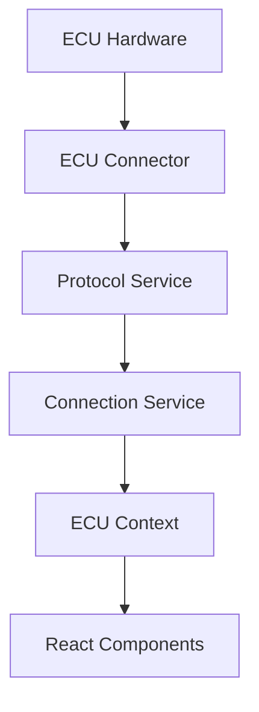

# ECU Connection Architecture

## Core Components

### 1. ECU Context Provider (`/src/ecu/context/ECUContext.tsx`)
- Main React Context provider
- Manages ECU connection state
- Provides connection methods to the application
- Handles state updates and component re-rendering

### 2. ECU State Management (`/src/ecu/context/ECUReducer.ts`)
- Manages ECU connection state transitions
- Handles state updates through actions
- Maintains consistent state across the application

### 3. Connection Service (`/src/ecu/services/connectionService.ts`)
- Core logic for ECU connection
- Protocol detection and verification
- Error handling and retry mechanisms
- Connection state management

### 4. Protocol Service (`/docs/ecu-ProtocolServiceBased.js`)
- Manages protocol-based communication
- Implements singleton pattern for state consistency
- Handles protocol-specific initialization
- Manages ECU response parsing

### 5. ELM Protocol Initialization (`/docs/ecu-ElmProtocolInit.js`)
- ELM protocol setup and initialization
- Command formatting and validation
- Protocol timing management
- Error recovery mechanisms

### 6. ECU Connector (`/docs/ecu-ECUConnector.js`)
- Direct hardware communication interface
- Command transmission and response handling
- Connection retry logic
- Hardware state management

### 7. Protocol Helper (`/docs/ecu-ElmProtocolHelper.js`)
- Helper functions for protocol handling
- Response validation and parsing
- ECU address detection
- Protocol-specific utilities

## Connection Flow



1. **Initialization**
   - ECUContext initializes connection via `connectWithECU()`
   - ConnectionService begins protocol detection
   - ProtocolService establishes communication

2. **Protocol Detection**
   - Attempts auto-detection first
   - Falls back to manual protocol iteration
   - Verifies communication with ECU

3. **State Management**
   - ECUReducer maintains connection state
   - Components receive updates through context
   - Error states propagate through the system

## Error Handling

- Connection failures trigger retry mechanisms
- Protocol errors initiate fallback procedures
- State updates reflect connection status
- Components respond to connection state changes

## Usage Example

```typescript
const MyComponent = () => {
  const { state, connectWithECU } = useECU();
  
  useEffect(() => {
    if (state.status === ECUConnectionStatus.DISCONNECTED) {
      connectWithECU();
    }
  }, [state.status]);
  
  // Component rendering logic
};
```

## Best Practices

1. Always check connection state before sending commands
2. Implement proper error handling
3. Use provided hooks and context for ECU communication
4. Monitor connection status changes
5. Implement appropriate retry mechanisms
6. Handle disconnection scenarios gracefully

## Connection States

- DISCONNECTED
- CONNECTING
- CONNECTED
- CONNECTION_FAILED

## Contributing

When modifying the connection stack:

1. Maintain singleton patterns where implemented
2. Follow established error handling patterns
3. Update state management appropriately
4. Document protocol-specific changes
5. Test across different ECU types
